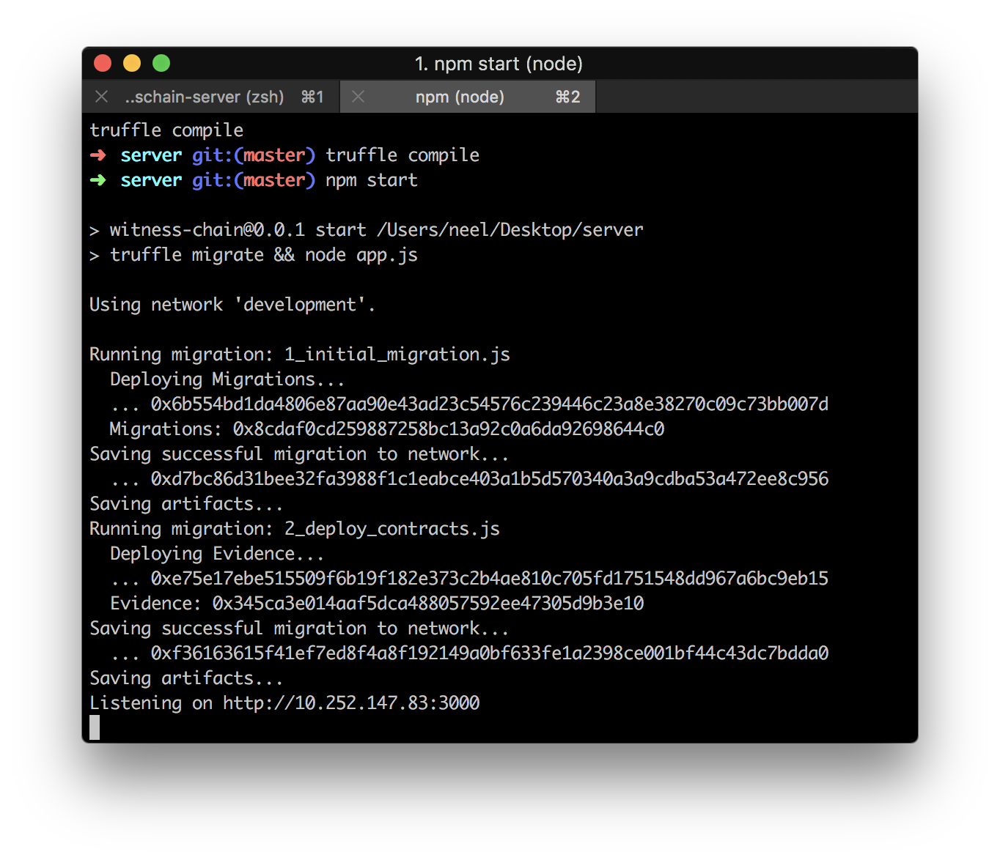
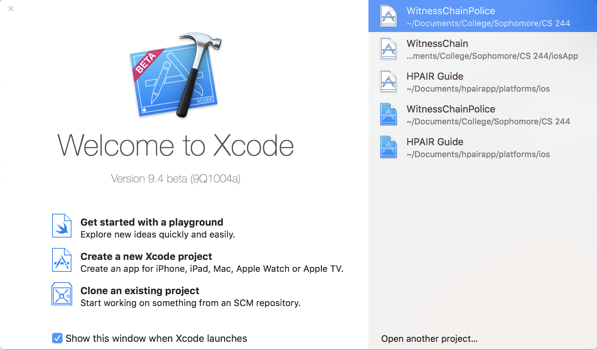
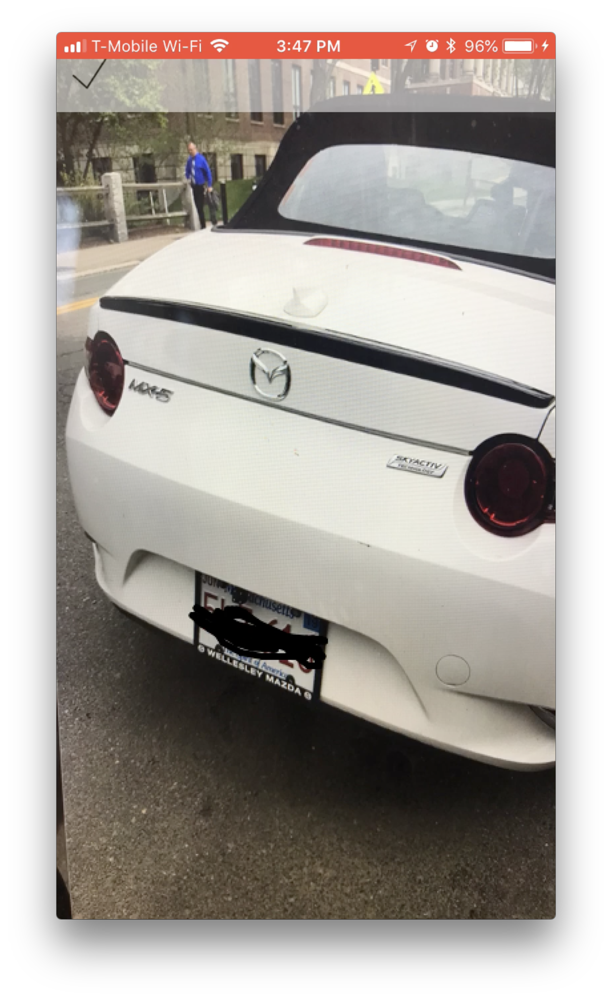
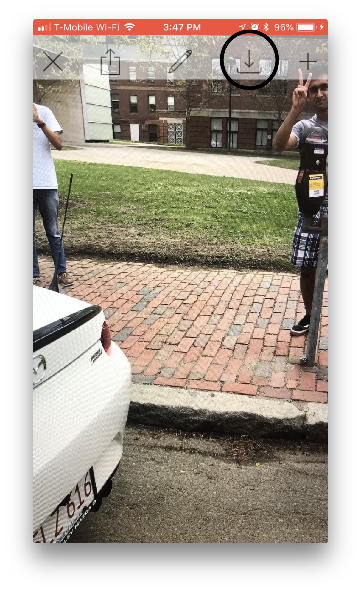
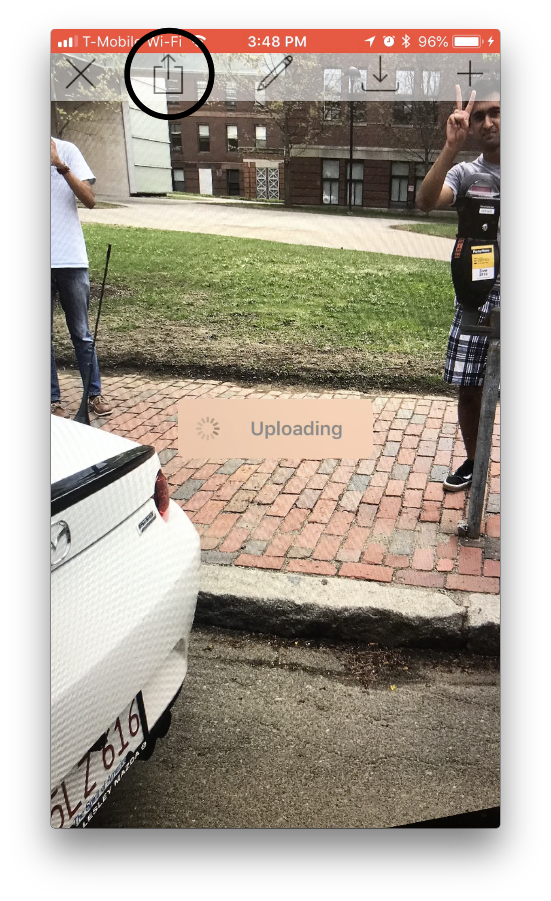

# WitnessChain iOS

## Quickstart

First off, make sure you've [set up the WitnessChain server](https://github.com/witnesschain/server) and have started running the server. It should look like this:



Now clone this repository by running:

```
git clone https://github.com/witnesschain/iosApp
```

Now open XCode on your Mac. Make sure you've accepted the license agreements. Open up your newly-cloned folder. The splash screen of XCode should look like this:



However, before installing our app on your phone, you will have to hardcode the address of the server in the app. Note the URL, which in this example is `http://10.252.147.83:3000`.

Then, navigate to the `appDelegate.swift` tab on the left, and look for a line that looks like this:

```
let baseUrl: String = "http://10.xxx.xxx.xx:xxxx"
```

You can just Command-F for `let baseURL`. Replace the placeholder string with the URL of the server, which again was `http://10.252.147.83:3000` in our example. Again, replace the string with the unique address that *your* server gave.

Then, plug in an iPhone to your computer, ensure that it is selected as the target device in the top left corner, and hit Play. The app should now be running on your phone!


## How to Use the App

The app begins with a login screen. Enter your credentials and create an account if you do not already have one.


Then, link your account to your Ethereum public address. This will ensure your wallet is the same as your public one, if you already have one.


Now, you should have arrived at the photo screen. Here, you can submit evidence to your police station. This begins by snapping a picture of an illegally parked car. You may have to take many pictures, to capture the situation. If so, use the next button, highlighted below.


For each photo, you must blur out any identification information. To do that, hit the edit button shown below.



After that, you can draw over any licence plates. If you want to save any photos to your camera roll, you do so by hitting the save button.



After you have taken all your pictures, simply hit the upload button to send them to your police station.



That is WitnessChain!

