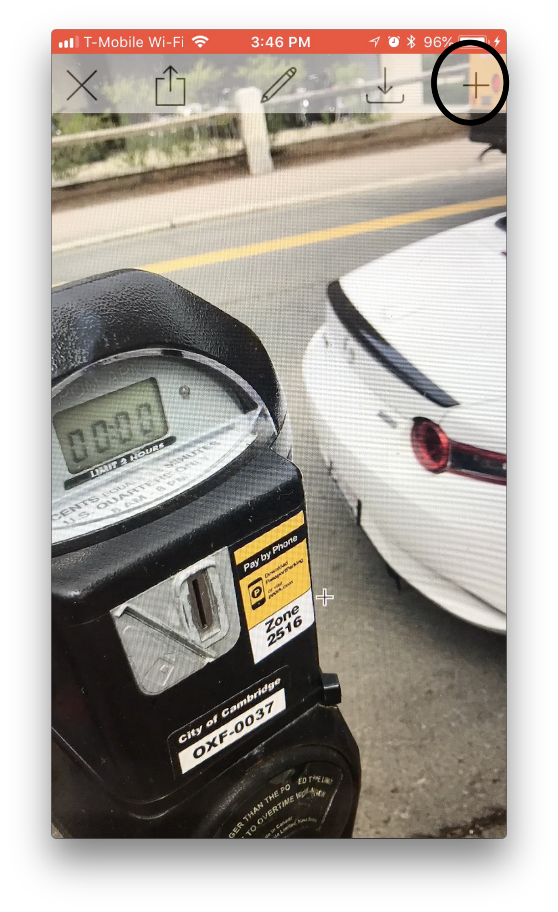

# iosApp

## Quickstart

Begin with a working installation of XCode. Clone our iosApp repository in your folder of choice by running:

```
git clone https://github.com/witnesschain/server
```
After that, open up Xcode and open any file within your newly cloned folder. This should get you to a screen that looks like this:


However, before installing our app on your phone, you will have to hardcode the address of the server that you started in the server Quickstart guide. You can locate the url in the terminal where you are running the server. It should look like this:


Then, navigate to the ```appDelegate.swift``` tab on the left, and look for line 19 of the code. You should see something that says

```
let baseUrl: String = "http://10.xxx.xxx.xx:xxxx"
```

Replace this string with your address that was given through your server terminal. Then, plug in an iPhone to your computer, ensure that it is selected as the target device in the top left corner, and hit play. The app should be running on your phone now.


## How to Use the App

The app begins with a login screen. Enter your credentials, and create an account if you do not already have one.


Then, link your account to your Ethereum public address. This will ensure your wallet is the same as your public one, if you already have one.


Now, you should have arrived at the photo screen. Here, you can submit evidence to your police station. This begins by snapping a picture of an illegally parked car. You may have to take many pictures, to capture the situation. If so, use the next button, highlighted below.



For each photo, you must blur out any identification information. To do that, hit the edit button shown below.


After that, you can draw over any licence plates. If you want to save any photos to your camera roll, you do so by hitting the save button.


After you have taken all your pictures, simply hit the upload button to send them to your police station.


That is WitnessChain!

